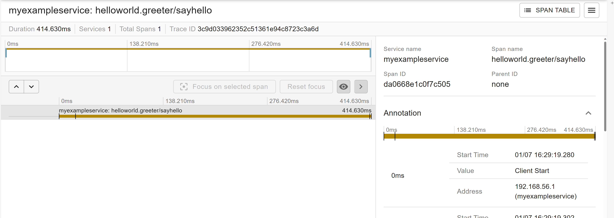
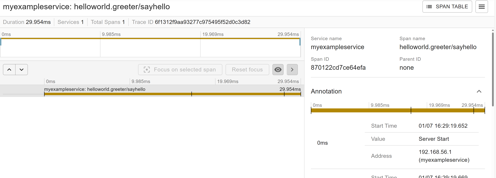

# GRPC Example

**Note:** This is an advanced scenario useful for people who want to *manually* instrument their own code.
(If you're using the [java agent](https://github.com/open-telemetry/opentelemetry-java-instrumentation), you get this instrumentation "out-of-the-box" and this isn't necessary.)

This is a simple example that demonstrates how to use the OpenTelemetry SDK
to *manually* instrument a simple GRPC based Client/Server application.
This example utilizes the [opentelemetry-grpc-1.6](https://github.com/open-telemetry/opentelemetry-java-instrumentation/tree/main/instrumentation/grpc-1.6/library#library-instrumentation-for-grpc-160)
to instrument both the GRPC client and server. 

# How to run

## Prerequisites
* Be on the grpc project root folder 
```shell script
cd grpc/
```

## 1 - Compile
```shell script
../gradlew shadowJar
```

## 2 - Start the Server
```shell script
java -cp ./build/libs/opentelemetry-examples-grpc-0.1.0-SNAPSHOT-all.jar io.opentelemetry.examples.grpc.HelloWorldServer
```

## 3 - Start the Client
```shell script
java -cp ./build/libs/opentelemetry-examples-grpc-0.1.0-SNAPSHOT-all.jar io.opentelemetry.examples.grpc.HelloWorldClient
```

## Result


